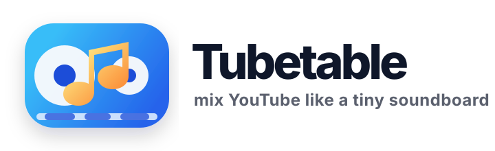
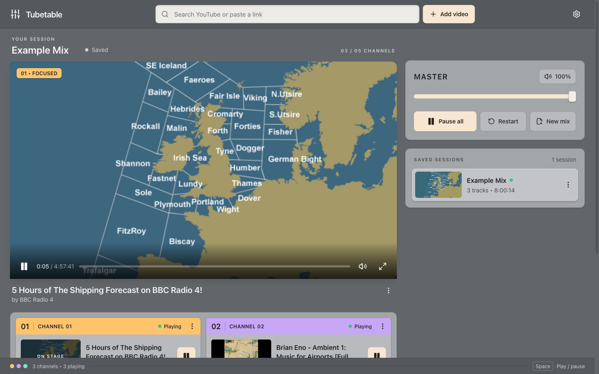

# Tubetable



Tubetable is a local browser app for mixing YouTube clips. Add videos, play them together, and balance each channel like a small soundboard.



## Features

- Search YouTube or paste a YouTube URL
- Mix up to five video channels
- Control per-channel volume and master volume
- Pause, mute, solo, loop, remove, and reorder channels
- Save mixes to a library in browser local storage; saved mixes update automatically
- Resume saved mixes with playback positions, and undo a delete
- Use light or dark mode

## Run Locally

Install dependencies:

```sh
bun install
```

Start the local app:

```sh
bun run dev
```

Open:

```txt
http://localhost:3000
```

If you do not have Bun installed:

```sh
curl -fsSL https://bun.sh/install | bash
```

## Scripts

```sh
bun run dev
```

Starts the local development server with hot reload.

```sh
bun run build
```

Builds the frontend into `dist/`.

```sh
bun run start
```

Runs the Bun server in production mode.

## Project Layout

```txt
src/
  App.tsx                 app state and behavior
  index.ts                Bun server entry
  index.html              frontend shell
  index.css               Tailwind and app styles
  components/             UI sections and controls
  lib/                    mix storage, channel logic, YouTube helpers
  types.ts                shared types

docs/
  api.md                  local JSON API reference
  lofi-lowpass-effect.md  notes for future lofi filter work
```

## Local Data

Saved mixes live in browser local storage. There is no account system, database, or required API key. Clearing site data clears saved mixes.

## API

Local routes:

```txt
/api/youtube/search?q=...
/api/youtube/video?videoId=...
```

See [docs/api.md](docs/api.md) for request parameters, response shapes, status codes, and cache behavior.

The app reads public YouTube page data rather than using a YouTube API key. Search may need parser updates if YouTube changes its page structure.

## Deploy

Tubetable runs locally and isn't deployed. The API routes live in the Bun server in `src/server.ts`, so any future deploy needs to serve them from the same origin as the app.
